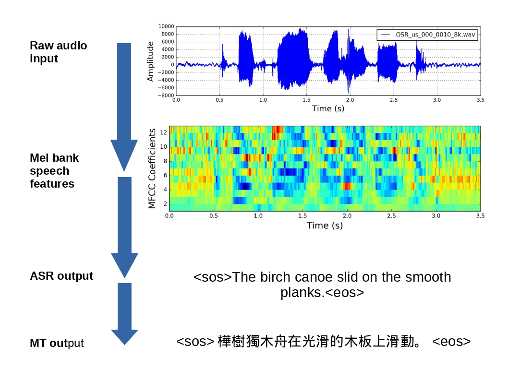
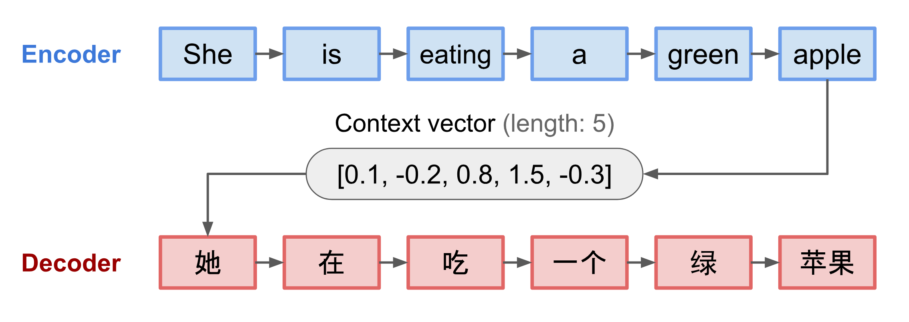
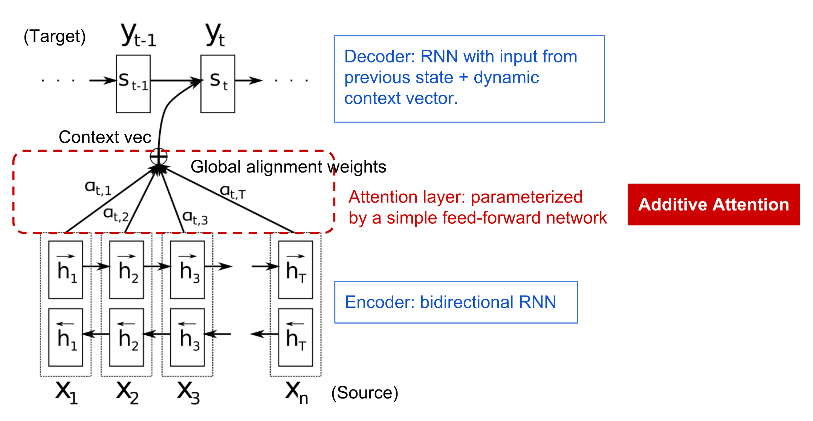
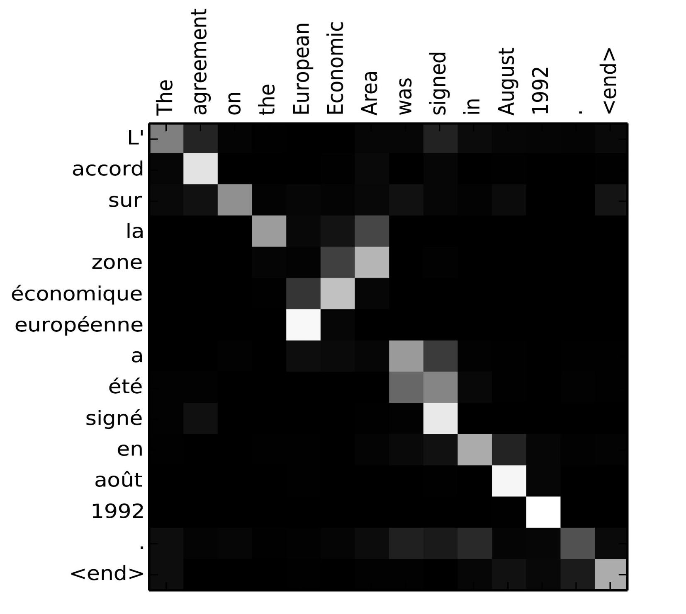
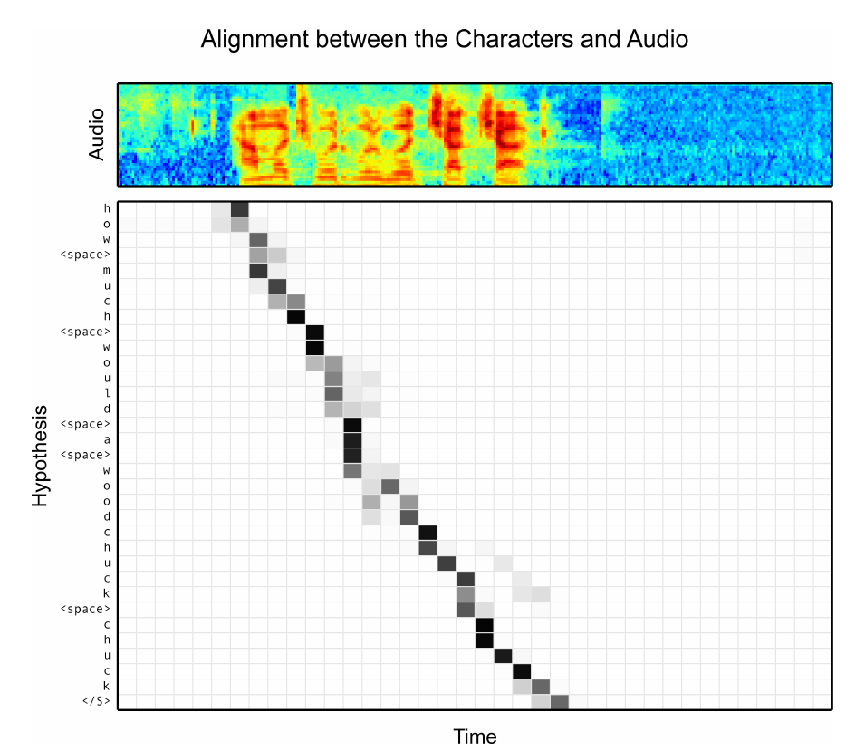
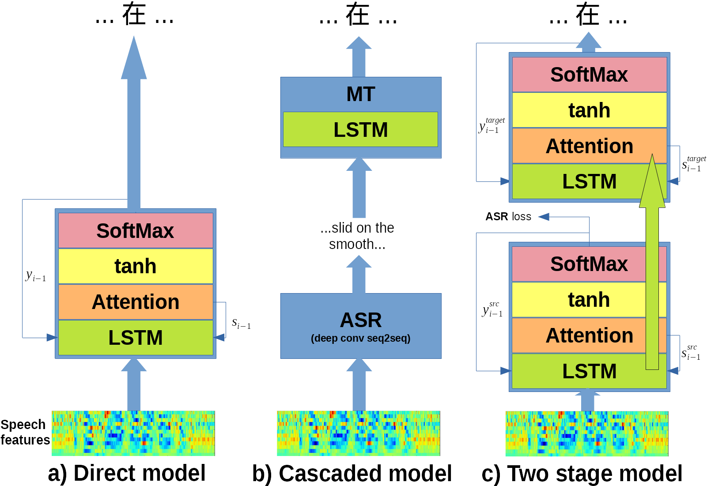
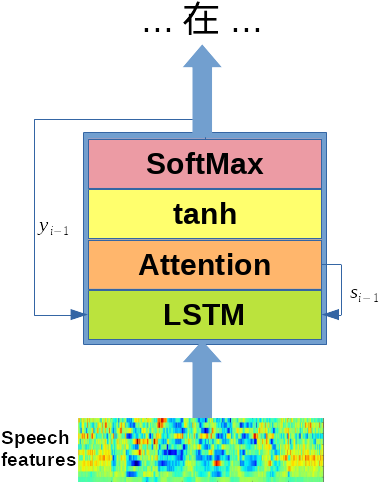
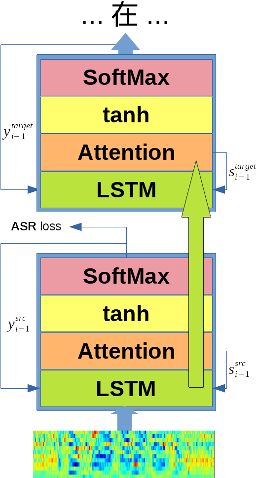
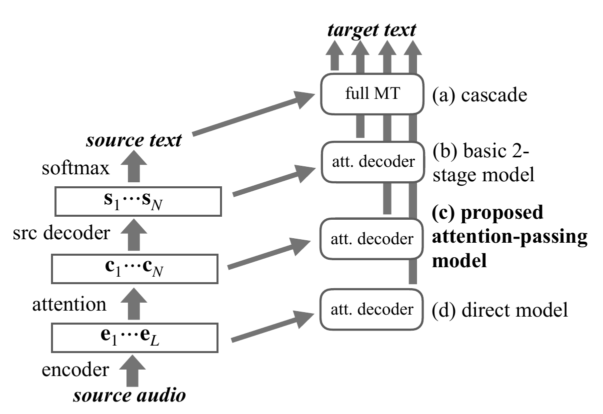

# Introduction

## Abstract

**Attention-Passing Models for Robust**\newline
**and Data-Efficient End-to-End Speech Translation**\newline
*Matthias Sperber*, *Graham Neubig*, *Jan Niehues*, *Alex Waibel*
\newline
\newline
\newline
Three main achievements:

- Compares performance and data efficiency of *direct* to *cascaded* models for speech translation
- Application of a *two-stage* model for end to end speech translation
- Introduction of an *attention-passing* enhancement for the two-stage model

## Context

- Speech translation: audio input $\rightarrow$ text translations
- Previously: cascadeding an automatic speech recognition (ASR) \newline and a machine translation (MT) component
- Problem: propagation of error, source text coming from ASR component might be erroneous and lead to folow-up errors

## Context

- More recently: Huge interest in direct models for end to end training of speech translation
- But: Reports comparing direct and cascaded models give no clear result yet
- But: usually more training data available for cascaded models as ASR and MT components can be trained seperately

## Overview (Task)

{ height=85% }

# Attention mechanism

## Vanilla sequence to sequence model

- Fixed context vector length from encoder's last hidden state
- Problem: Can't remember long sentences. Model has "forgotten" first part when processing whole input.

## Attention basic idea

- build "shortcuts" between context vector and source input
- decoder can "attend" to different parts of the input at every output step
- now each decoder output word depends on a weighted combination of **all input states**

##
\centering 

##
\centering
{ height=90% }

\raggedleft \footnotesize from Chan et al.: **Listen, Attend and Spell** (2017)

# Models in detail

## Overview (Architectures)

{ height=90% }

## Introduction

All of the models have in common:
- Audio input encoded as Mel-Bank-Features

## Cascaded model

\columnsbegin
\column{.3\textwidth}
TODO

\column{.68\textwidth}

- traditionally used and still state of the art
- easier to learn complex audio to text mapping
- cannot be trained end to end
- but: can make use of more abundant text translation and speech recognition corpi
- propagation of error problem

\columnsend

## Direct model

\columnsbegin
\column{.3\textwidth}
{ height=80% }

\column{.68\textwidth}

\begin{equation}
\begin{split}
\var{s_i} &= \LSTM([\weight{W_e} \weight{y_{i-1}}\sep \var{c_{i-1}}], \var{s_{i-1}}\sep \theta_\mathnormal{lstm}) \\
\var{c_i} &= \Attention([\var{s_i} \var{e}_{1:L}\sep\theta_{\mathnormal{att}}]) \\
\var{\widetilde{s_i}} &= \tanh(\weight{W_s}[\var{s_{i}}\sep\var{c_i}] + \var{b_s}) \\
& \mathit{p}(y_i \lvert y_{<i}, e_{1:L}) = \mathrm{SoftMaxOut}(\var{\widetilde{s_i}} \sep \theta_{\mathnormal{out}})
\end{split}
\end{equation}
\newline
Variables:

- $e_{1:L}$ $L$ audio encoder states
- $\weight{W_*}$, $\theta_{\mathnormal{*}}$, $\var{b_s}$ trainable parameters
- $y_i$ output characters

\columnsend

## Direct model

\columnsbegin
\column{.3\textwidth}
{ height=80% }

\column{.68\textwidth}

- more recently shown 
- complex mapping from audio to text has to be learned in the model with little guidance
- needs speech to translation datasets for training $\Rightarrow$ a lot less data available

\columnsend

## Two stage model

\columnsbegin
\column{.3\textwidth}
{ height=80% }

\column{.68\textwidth}

\begin{equation}
\begin{split}
\var{s^{src}_i} &= \LSTM([\weight{W^{src}_e} \weight{y^{src}_{i-1}}\sep \var{c^{src}_{i-1}}], \var{s^{src}_{i-1}}\sep \theta^{src}_\mathnormal{lstm}) \\
\var{c^{src}_i} &= \Attention([\var{s^{src}_i},\var{e}_{1:L}\sep\theta^{src}_{\mathnormal{att}}]) \\
\var{\widetilde{s}^{src}_i} &= \tanh(\weight{W^{src}_s}[\var{s^{src}_{i}}\sep\var{c^{src}_i}] + \var{b^{src}_s}) \\
& \mathit{p}(y^{src}_i \lvert y_{<i}, e_{1:L}) = \mathrm{SoftMaxOut}(\var{\widetilde{s}^{src}_i} \sep \theta^{src}_{\mathnormal{out}})
\end{split}
\end{equation}

\begin{equation}
\begin{split}
\var{s^{trg}_i} &= \LSTM([\weight{W^{trg}_e} \weight{y^{trg}_{i-1}}\sep \var{c^{trg}_{i-1}}], \var{s^{trg}_{i-1}}\sep \theta^{trg}_\mathnormal{lstm}) \\
\var{c^{trg}_i} &= \Attention([\var{s^{trg}_i} \var{s}^{src}_{1:N}\sep\theta^{trg}_{\mathnormal{att}}]) \\
\var{\widetilde{s}^{trg}_i} &= \tanh(\weight{W^{trg}_s}[\var{s^{trg}_{i}}\sep\var{c^{trg}_i}] + \var{b^{trg}_s}) \\
& \mathit{p}(y^{trg}_i \lvert y_{<i}, e_{1:L}) = \mathrm{SoftMaxOut}(\var{\widetilde{s}^{trg}_i} \sep \theta^{trg}_{\mathnormal{out}})
\end{split}
\end{equation}

\columnsend

## Two stage model

- two encoder-decoder stages, but decoder of first and encoder of second stage shared:
  - unlike cascaded model the second stage does not use the ASR output
  - calculates attention vectors directly on the first decoder state: \newline $\var{c^{trg}_i} = \Attention([\var{s^{trg}_i} \var{s}^{src}_{1:N}\sep\theta^{trg}_{\mathnormal{att}}])$
- keeps end-to-end trainability
- can also be trained with ASR and MT data

# Model comparison

## 

# Attention passing model

## Architecture comparision

# Performance

## Bleu score

## Datasets

## Data efficiency

# Closing

## Comments

- differences in architecture might make them less comparable

## Related work

## References

